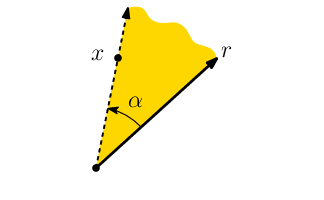
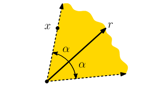
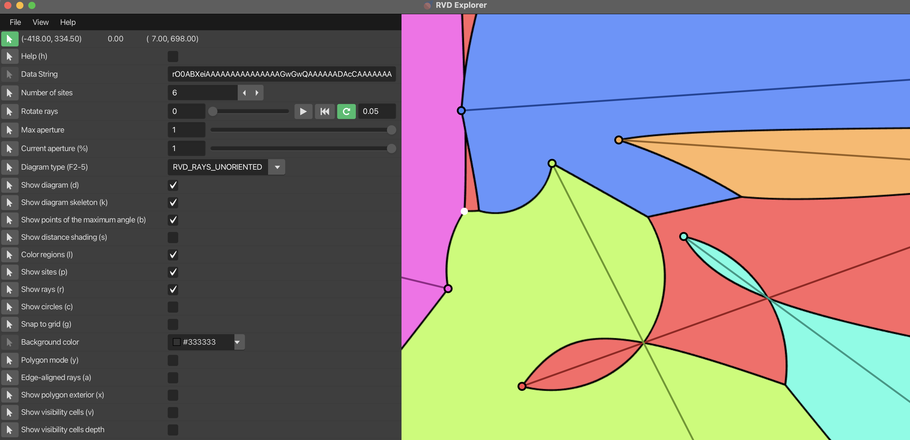
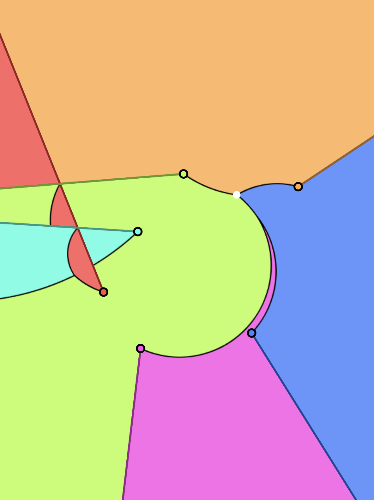
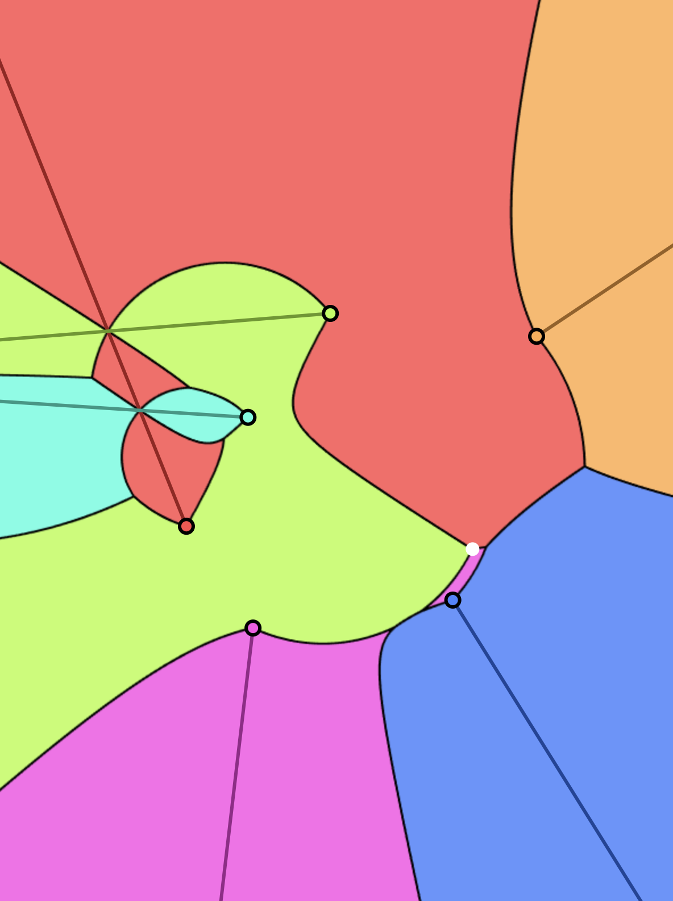
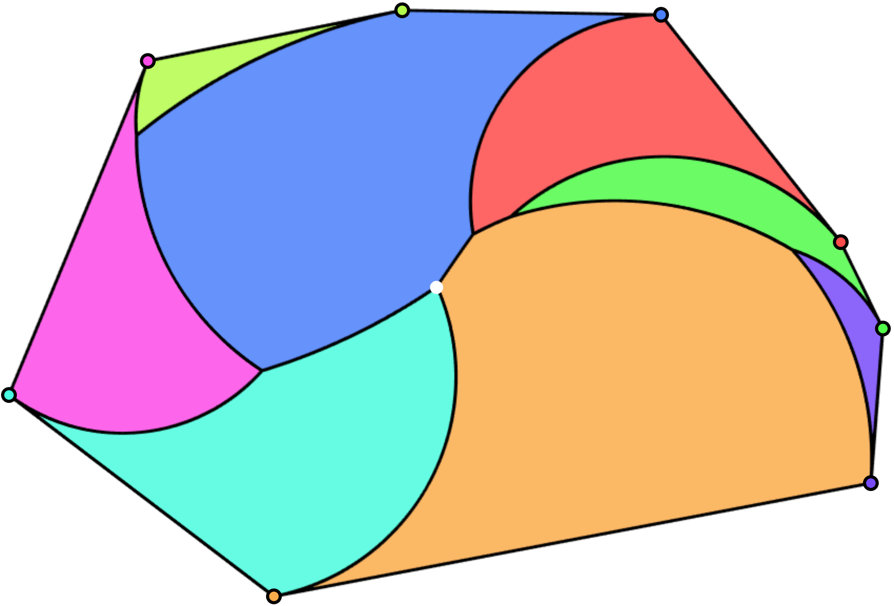
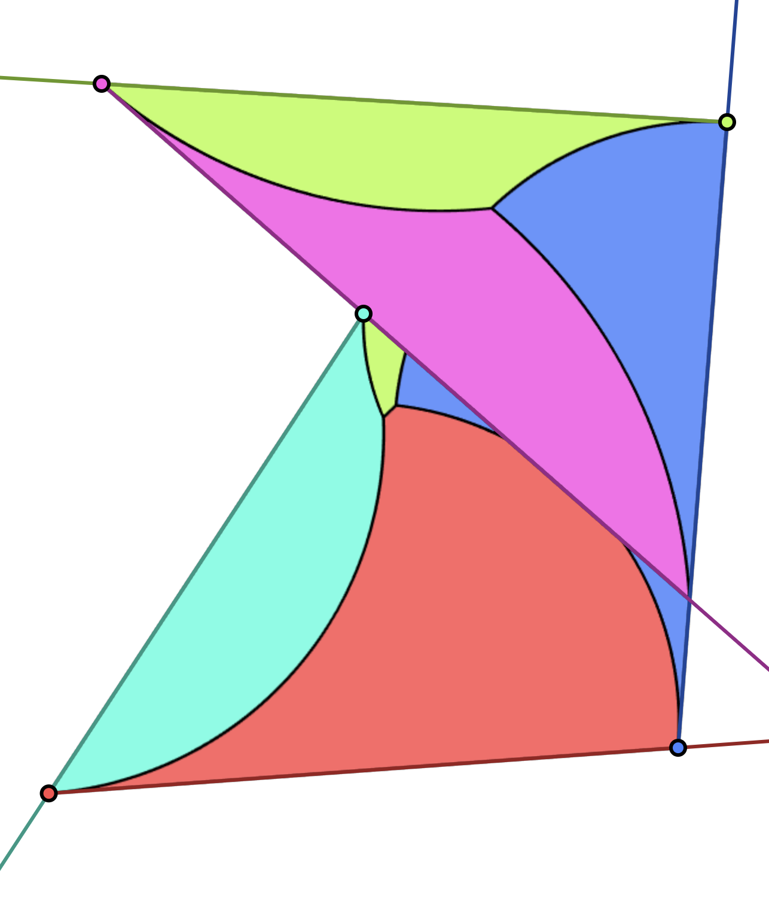
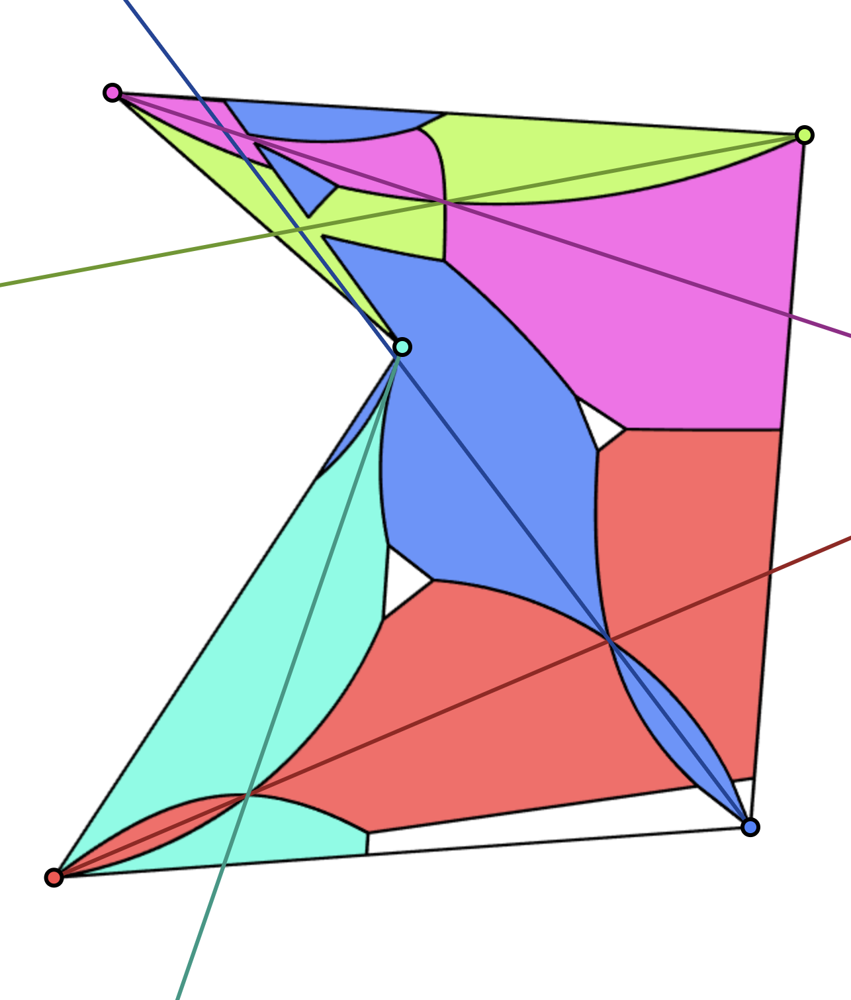

# rvd-explorer

Desktop explorer for **rotational Voronoi–style diagrams**, built with **Java 25**, **JavaFX**, and the **DrawingFX** / **mars-bits** libraries. The main entry point is `rvd.RVDExplorer`: a single window with interactive gadgets, diagram modes, and serialization via the “Data String” field.

## Overview

### Floodlights, angular distance, and the diagram

**Floodlight illumination** problems are **art-gallery**–style questions: a **domain** must be illuminated by **guards**, each with a limited **field of view**.

The **rotating rays Voronoi diagram** (**RVD**) is a Voronoi diagram whose sites are **rays** in the plane, using an **angular distance** instead of Euclidean distance. There is a natural link between this structure and **uniform-aperture floodlights**: finding the **smallest aperture** such that a given set of floodlights covers the domain is tied to the geometry of the RVD.

### Oriented vs unoriented distance

Fix a ray *r* and a point *x* in the plane.

- **Oriented angular distance** is the **counterclockwise** angle by which you must rotate *r* around its **apex** until the ray passes through *x*.
- **Unoriented angular distance** is the **smaller** of that angle and its complement to a full turn (so it is symmetric with respect to the ray’s direction).

An **α-floodlight** around *r* is the cone of points whose angular distance to *r* is **at most α**.



Schematic of **oriented** angular distance and an α-floodlight cone around a ray.



Schematic of **unoriented** angular distance and the corresponding α-floodlight.

### Two related problems

Given a domain **D** and a set **R** of **n** rays:

1. **Minimum-aperture floodlight illumination** — Each ray carries an **α-floodlight**. Find the **minimum α** (often denoted α*) such that the union of these cones **covers** **D**.

2. **Rotating rays Voronoi diagram** — Partition **D** into regions: each region is the set of points in **D** that are **closest** to a fixed ray under the chosen angular distance.

Each problem comes in **oriented** and **unoriented** variants, depending on which distance is used.

### This repository

**RVD explorer** is an **interactive visualization** that supports **both** distance models and **several domain types** (full plane and polygons). The [Software description](#software-description) below lists the main UI features; [Illustrative examples](#illustrative-examples) show RVD diagrams produced in the tool.

---

## Software description

### What you see

**RVD explorer** lets you explore rotating rays Voronoi diagrams and the minimum-aperture floodlight viewpoint in an interactive window.



Screenshot of **RVD explorer** with an unoriented rotating rays Voronoi diagram in the plane.

### Main controls (high level)

- **Number of sites** — How many rays (sites) participate.
- **Diagram type** — **`RVD_RAYS_ORIENTED`** vs **`RVD_RAYS_UNORIENTED`** (oriented vs unoriented angular distance).
- **Colors** — Each site (and its Voronoi region) has a **distinct color**.
- **Show diagram skeleton** — Highlights the **graph structure** of the diagram in black.
- **Show point of maximum angle** — Marks (white disk) a point in the current view that realizes the **critical aperture** for the floodlight interpretation: informally, the **last** point covered if all floodlight apertures grow together from 0 toward the minimum covering aperture.
- **Max aperture** — Upper bound on the aperture (slider).
- **Current aperture (%)** — Explore coverage at a **fraction** of that maximum.
- **Rotate rays** — Adjust ray directions interactively.
- **Help** — Opens the **full list** of shortcuts and options.

### Domains: plane vs polygon

**Polygonal domain** toggles between:

- **Whole plane** — Place rays anywhere; distances are evaluated in **ℝ²**.
- **Simple polygon** — A polygon **P** is fixed; typically **one ray per vertex**, and distances are evaluated **inside P** only.

**Edge-aligned rays** (polygon mode) — When enabled, each polygon edge induces a ray at one vertex through the next (Brocard-style illumination); see [Illustrative examples](#illustrative-examples) for simple-polygon diagrams.

### Implementation (brief)

- **UI:** **JavaFX**.
- **Rendering:** **Pixel rasterization** of the viewport. For each pixel, angular distances to all rays are evaluated and the pixel is colored by the **nearest** site — **O(n × width × height)** per frame, **CPU**-based.
- **Responsiveness:** Rows processed in **parallel**; angle **comparisons** avoid computing explicit angle values where possible.
- **Edges:** Detected by comparing neighboring pixel assignments; **supersampling** for anti-aliasing on diagram edges.
- **Gadgets / UI layer:** Built with a **small custom library** for interactive parameters.

---

## Illustrative examples



Rotating rays Voronoi diagram of five rays in **ℝ²** using **oriented** angular distance.



The same ray configuration in the plane using **unoriented** angular distance.



RVD inside a **convex** octagon with rays **edge-aligned** to the boundary (Brocard-style layout).



RVD of a **simple** pentagon with **edge-aligned** rays.



The same simple-polygon setting with rays pointing in the interior, and additionally with a **bounded maximum aperture** (π/12) on the floodlights.

---

## How to give credit

If you use this software or its ideas in a **scientific** context (publications, talks, coursework with attribution), please **cite the associated paper** *Interactive Uniform Floodlight Illumination and Rotating Rays Voronoi diagrams* which will be presented in **35th International Computational Geometry Media Exposition**, part of **Computational Geometry Week 2026**, taking place in **NJ, USA**.

> *(Citation and link to be updated.)*

## How to get in touch

For everything not covered here:

- **Marko Savić** — [marko.savic@dmi.uns.ac.rs](mailto:marko.savic@dmi.uns.ac.rs)
- **Ioannis Mantas** — [ioanni.mantas@gmail.com](mailto:ioanni.mantas@gmail.com)

## How to use

Prebuilt **JAR** builds are attached to **GitHub Releases**. Open the [**latest release**](https://github.com/marsavic/rvd-explorer/releases/latest) (or the [**Releases**](https://github.com/marsavic/rvd-explorer/releases) tab on this repository), download **`rvd-explorer.jar`** from **Assets**, and run it with a **JDK 25 + JavaFX** install (see [Requirements and dependencies](#requirements-and-dependencies)):

```bash
java --add-modules javafx.controls -jar rvd-explorer.jar
```

If there is no release yet, or you need a development build, use [How to build](#how-to-build) below.

## How to build

You need the **toolchain and libraries** described in [Requirements and dependencies](#requirements-and-dependencies) below (JDK+FX 25, local JARs, Gradle Wrapper). No global Gradle installation is required.

**Build** (compile, tests, artifacts):

```bash
./gradlew build
```

Clean rebuild:

```bash
./gradlew clean build
```

**Run** from a clone:

```bash
./gradlew run
```

The `run` task adds `--add-modules javafx.controls` and uses the project directory as the working directory. Without Gradle:

```bash
java --add-modules javafx.controls … rvd.RVDExplorer
```

(use the same module flag and classpath your Gradle build would produce).

**Fat JAR** (application plus bundled library JARs; JavaFX still comes from your JDK+FX install):

```bash
./gradlew shadowJar
```

Output: `build/libs/rvd-explorer.jar`. Run:

```bash
java --add-modules javafx.controls -jar rvd-explorer.jar
```

Prebuilt **`rvd-explorer.jar`** may be attached to **GitHub Releases** when you publish a release (see [Continuous integration and releases](#continuous-integration-and-releases)).

## Requirements and dependencies

**Requirements**

- **JDK 25** that includes **JavaFX** (the `javafx.controls` module is used at compile time, for tests, and at runtime).

  Examples of suitable distributions:

  - [BellSoft Liberica JDK **Full** / `jdk+fx`](https://bell-sw.com/pages/downloads/) (also what CI uses)
  - Other **JDK+FX** builds that ship the `javafx.*` modules on the module path

  A plain JDK without JavaFX (e.g. standard Temurin) is **not** enough unless you add JavaFX yourself.

- **Gradle** is not required globally; the repo includes the **Gradle Wrapper** (`./gradlew`).

**Dependencies**

| Kind | Artifact |
|------|-----------|
| Local JARs (committed next to `build.gradle`) | `drawing-fx-2-2022-03-18.jar`, `mars-bits-2026-03-18.jar` |
| Tests | JUnit 5 (via `junit-bom` on Maven Central) |

JavaFX comes from the **JDK+FX** install, not from Maven in this project.

## Continuous integration and releases

- **CI** (`.github/workflows/ci.yml`): on every **pull request** and on **pushes to `main`**, runs `./gradlew build` on Ubuntu with **Liberica JDK 25 + JavaFX** (`jdk+fx`).
- **Release** (`.github/workflows/release.yml`): when you **publish** a GitHub Release, runs tests and `shadowJar`, then uploads **`rvd-explorer.jar`** to that release.

## How to contribute

1. **Branch or fork**, make a focused change set, and open a **pull request** against `main`.
2. **CI must pass**: the PR should show a **green** status for the required checks (e.g. **`CI / build`**). Run `./gradlew build` locally with JDK+FX 25 before pushing when possible.
3. Follow the existing **code style** (`rvd.*` packages, conventions in nearby code); avoid unrelated refactors unless agreed.
4. Add or update **tests** under `src/test/java` when you fix or specify behavior.
5. If you change **dependencies**, **Java version**, or **CI assumptions**, update this README and `.github/workflows/` as needed.

## Repository layout (short)

- `src/` — main Java sources and `META-INF` (test sources are under `src/test/java`, not under `src/test/` inside `src/`).
- `images/` — image resources used by the app.
- `docs/figures/` — figures used in this README.
- `build.gradle`, `settings.gradle`, `gradlew*` — Gradle build and wrapper.
- `.github/workflows/` — CI and release automation.

## License

**MIT** — see [`LICENSE`](LICENSE). You may use, copy, modify, merge, publish, distribute, sublicense, and/or sell copies of this project’s **source code in this repository**, subject to the license terms (including keeping the copyright notice).

The bundled third-party JARs (`drawing-fx-…`, `mars-bits-…`) remain under **their** authors’ licenses; this repo’s MIT license applies to the **rvd-explorer** code here, not to relicensing those libraries.
